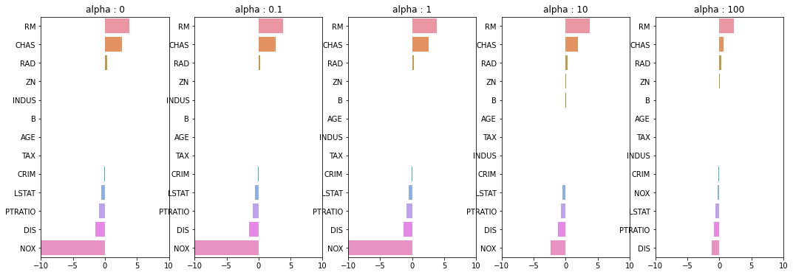

---  
layout: post  
title: "릿지, 라쏘, 엘리스틱넷"
subtitle: "선형회귀 규제모델에 대한 실습"  
categories: DATA
tags: DATA python Python_Data Ridge Lasso ElasticNet
comments: true  
---  

> 본 페이지는 **파이썬 머신러닝 완벽가이드**를 공부하며 작성한 내용이다


# 규제 선형 모델의 개요
- 좋은 머신러닝 회귀 모델이란 **데이터에 적합하면서 회귀 계수가 커지는 것을 제한한 모델**
- 회귀계수가 커지면 변동성이 심해져 테스트 데이터 세트 예측에서 성능이 저하됨
- 이에 규제 선형 모델은 L1규제, L2규제 등을 활용하여 회귀계수가 커지면 비용함수가 커지도록 식을 구성하여 회귀계수가 커지는 것을 제어함


```python
# 패키지
import numpy as np
import matplotlib.pyplot as plt
import pandas as pd
import seaborn as sns
from scipy import stats
from sklearn.datasets import load_boston
%matplotlib inline

from sklearn.model_selection import train_test_split
from sklearn.linear_model import LinearRegression
from sklearn.metrics import mean_squared_error, r2_score # MSE

# boston 주택 가격 데이터 세트 로드
boston = load_boston()

# boston 데이터 세트 DataFrame으로 변환
df = pd.DataFrame(boston.data, columns=boston.feature_names)

# target값 추가
df["PRICE"] = boston.target
print("boston 데이터 크기 :", df.shape)
df.head(3)

# train test split
y_target = df["PRICE"]
X_data = df.drop("PRICE", axis=1,inplace=False)

X_train, X_test, y_train, y_test = train_test_split(X_data, y_target, test_size=0.3, random_state=156)
```

    boston 데이터 크기 : (506, 14)
    

## 릿지 회귀


```python
from sklearn.linear_model import Ridge
from sklearn.model_selection import cross_val_score

# alpha=10
ridge = Ridge(alpha = 10)
neg_mse_scores = cross_val_score(ridge, X_data, y_target, scoring="neg_mean_squared_error", cv=5)
rmse_scores = np.sqrt(-1 * neg_mse_scores)
avg_rmse = np.mean(rmse_scores)

# 결과
print("개별 Negative MSE :", np.round(neg_mse_scores, 2))
print("개별 RMSE :", np.round(rmse_scores,2))
print("rmse 평균 :", np.round(avg_rmse,2))
```

    개별 Negative MSE : [-11.42 -24.29 -28.14 -74.6  -28.52]
    개별 RMSE : [3.38 4.93 5.31 8.64 5.34]
    rmse 평균 : 5.52
    


```python
# alpha를 변경하며 수행
alphas = [0,0.1,1,10,100]

for i,alpha in enumerate(alphas):
    ridge = Ridge(alpha = alpha)
    neg_mse_scores = cross_val_score(ridge, X_data, y_target, scoring="neg_mean_squared_error", cv=5)
    rmse_scores = np.sqrt(-1 * neg_mse_scores)
    avg_rmse = np.mean(rmse_scores)
    print(f"alhpa = {alphas[i]}일 때, rmse 평균 :", np.round(avg_rmse,2))
```

    alhpa = 0일 때, rmse 평균 : 5.83
    alhpa = 0.1일 때, rmse 평균 : 5.79
    alhpa = 1일 때, rmse 평균 : 5.65
    alhpa = 10일 때, rmse 평균 : 5.52
    alhpa = 100일 때, rmse 평균 : 5.33
    


```python
fig, axs = plt.subplots(figsize=(18,6), nrows=1, ncols=5)

coeff_df = pd.DataFrame()

for pos, alpha in enumerate(alphas):
    ridge = Ridge(alpha = alpha)
    ridge.fit(X_data, y_target)
    coeff = pd.Series(ridge.coef_, index=X_data.columns)
    col_name = "alpha : "+ str(alpha)
    coeff_df[col_name] = coeff
    # 막대그래프
    coeff = coeff.sort_values(ascending=False)
    axs[pos].set_title(col_name)
    axs[pos].set_xlim(-10,10)
    sns.barplot(x=coeff.values, y=coeff.index, ax=axs[pos])

plt.show()
```


<!--  -->


- alpha를 높일수록 NOX의 회귀계수 값이 줄어듬

## 라쏘 회귀


```python
from sklearn.linear_model import Lasso, ElasticNet

def get_linear_reg_eval(model_name, params=None, X_data_n=None, y_target_n=None, verbose=True, return_coeff=True):
    coeff_df = pd.DataFrame()
    if verbose : print("#####", model_name, "#####")
    for param in params:
        if model_name == "Ridge" : model = Ridge(alpha=param)
        elif  model_name == "Lasso" : model = Lasso(alpha=param)
        elif  model_name == "ElasticNet" : model = ElasticNet(alpha=param, l1_ratio=0.7)
        neg_mse_scores = cross_val_score(model, X_data_n,y_target_n, scoring = "neg_mean_squared_error", cv = 5)
        avg_rmse = np.mean(np.sqrt(-1 * neg_mse_scores))
        print(f"alpha {param}일 때 평균 RMSE = {avg_rmse:.3f}")
        
        # cross_val_score는 evaluation metric만 반환하므로 모델을 재학습하여 회귀계수 추출
        model.fit(X_data_n, y_target_n)
        if return_coeff:
            coeff = pd.Series(data=model.coef_, index=X_data.columns)
            colname="alpha : "+str(param)
            coeff_df[colname] = coeff
    
    return coeff_df
```


```python
lasso_alphas = [0.01,0.07,0.1,0.5,1,3,5,10]
coeff_lasso_df = get_linear_reg_eval("Lasso", params=lasso_alphas, X_data_n=X_data, y_target_n=y_target)
```

    ##### Lasso #####
    alpha 0.01일 때 평균 RMSE = 5.740
    alpha 0.07일 때 평균 RMSE = 5.612
    alpha 0.1일 때 평균 RMSE = 5.615
    alpha 0.5일 때 평균 RMSE = 5.669
    alpha 1일 때 평균 RMSE = 5.776
    alpha 3일 때 평균 RMSE = 6.189
    alpha 5일 때 평균 RMSE = 6.375
    alpha 10일 때 평균 RMSE = 6.586
    


```python
sort_column = "alpha : "+str(lasso_alphas[0])
coeff_lasso_df.sort_values(by=sort_column, ascending=False)
```


<div>
<style scoped>
    .dataframe tbody tr th:only-of-type {
        vertical-align: middle;
    }

    .dataframe tbody tr th {
        vertical-align: top;
    }

    .dataframe thead th {
        text-align: right;
    }
</style>
<table border="1" class="dataframe">
  <thead>
    <tr style="text-align: right;">
      <th></th>
      <th>alpha : 0.01</th>
      <th>alpha : 0.07</th>
      <th>alpha : 0.1</th>
      <th>alpha : 0.5</th>
      <th>alpha : 1</th>
      <th>alpha : 3</th>
      <th>alpha : 5</th>
      <th>alpha : 10</th>
    </tr>
  </thead>
  <tbody>
    <tr>
      <th>RM</th>
      <td>3.814186</td>
      <td>3.789725</td>
      <td>3.703202</td>
      <td>2.498212</td>
      <td>0.949811</td>
      <td>0.000000</td>
      <td>0.000000</td>
      <td>0.000000</td>
    </tr>
    <tr>
      <th>CHAS</th>
      <td>2.504190</td>
      <td>1.434343</td>
      <td>0.955190</td>
      <td>0.000000</td>
      <td>0.000000</td>
      <td>0.000000</td>
      <td>0.000000</td>
      <td>0.000000</td>
    </tr>
    <tr>
      <th>RAD</th>
      <td>0.298526</td>
      <td>0.270936</td>
      <td>0.274707</td>
      <td>0.277451</td>
      <td>0.264206</td>
      <td>0.061864</td>
      <td>0.000000</td>
      <td>0.000000</td>
    </tr>
    <tr>
      <th>ZN</th>
      <td>0.046860</td>
      <td>0.049059</td>
      <td>0.049211</td>
      <td>0.049544</td>
      <td>0.049165</td>
      <td>0.037231</td>
      <td>0.038467</td>
      <td>0.026146</td>
    </tr>
    <tr>
      <th>B</th>
      <td>0.009485</td>
      <td>0.010248</td>
      <td>0.010249</td>
      <td>0.009469</td>
      <td>0.008247</td>
      <td>0.006510</td>
      <td>0.006286</td>
      <td>0.007496</td>
    </tr>
    <tr>
      <th>INDUS</th>
      <td>0.006474</td>
      <td>-0.042120</td>
      <td>-0.036619</td>
      <td>-0.005253</td>
      <td>-0.000000</td>
      <td>-0.000000</td>
      <td>-0.000000</td>
      <td>-0.000000</td>
    </tr>
    <tr>
      <th>AGE</th>
      <td>-0.001818</td>
      <td>-0.011706</td>
      <td>-0.010037</td>
      <td>0.003604</td>
      <td>0.020910</td>
      <td>0.042495</td>
      <td>0.031679</td>
      <td>0.000000</td>
    </tr>
    <tr>
      <th>TAX</th>
      <td>-0.012627</td>
      <td>-0.014290</td>
      <td>-0.014570</td>
      <td>-0.015442</td>
      <td>-0.015212</td>
      <td>-0.008602</td>
      <td>-0.007669</td>
      <td>-0.009282</td>
    </tr>
    <tr>
      <th>CRIM</th>
      <td>-0.106228</td>
      <td>-0.098193</td>
      <td>-0.097894</td>
      <td>-0.083289</td>
      <td>-0.063437</td>
      <td>-0.000000</td>
      <td>-0.000000</td>
      <td>-0.000000</td>
    </tr>
    <tr>
      <th>LSTAT</th>
      <td>-0.530481</td>
      <td>-0.560431</td>
      <td>-0.568769</td>
      <td>-0.656290</td>
      <td>-0.761115</td>
      <td>-0.807679</td>
      <td>-0.747258</td>
      <td>-0.564038</td>
    </tr>
    <tr>
      <th>PTRATIO</th>
      <td>-0.916369</td>
      <td>-0.765107</td>
      <td>-0.770654</td>
      <td>-0.758752</td>
      <td>-0.722966</td>
      <td>-0.265072</td>
      <td>-0.000000</td>
      <td>-0.000000</td>
    </tr>
    <tr>
      <th>DIS</th>
      <td>-1.422155</td>
      <td>-1.176583</td>
      <td>-1.160538</td>
      <td>-0.936605</td>
      <td>-0.668790</td>
      <td>-0.000000</td>
      <td>-0.000000</td>
      <td>-0.000000</td>
    </tr>
    <tr>
      <th>NOX</th>
      <td>-14.394478</td>
      <td>-0.000000</td>
      <td>-0.000000</td>
      <td>-0.000000</td>
      <td>-0.000000</td>
      <td>0.000000</td>
      <td>0.000000</td>
      <td>0.000000</td>
    </tr>
  </tbody>
</table>
</div>


## ElasticNet


```python
elastic_alphas = [0.07, 0.1, 0.5, 1, 3]
coeff_elastic_df = get_linear_reg_eval("ElasticNet", params=elastic_alphas, X_data_n=X_data, y_target_n=y_target)
```

    ##### ElasticNet #####
    alpha 0.07일 때 평균 RMSE = 5.542
    alpha 0.1일 때 평균 RMSE = 5.526
    alpha 0.5일 때 평균 RMSE = 5.467
    alpha 1일 때 평균 RMSE = 5.597
    alpha 3일 때 평균 RMSE = 6.068
    


```python
# method는 Standar, Minax, Log 결정
from sklearn.preprocessing import StandardScaler, MinMaxScaler # Scaler
from sklearn.preprocessing import PolynomialFeatures

def get_scaled_data(method="None", p_degree=None, input_data=None):
    if method == "Standard":
        scaled_data = StandardScaler().fit_transform(input_data)
    elif method == "MinMax":
        scaled_data = MinMaxScaler().fit_transform(input_data)
    elif method == "Log":
        scaled_data = np.log1p(input_data)
    else:
        scaled_data = input_data
    
    if p_degree != None:
        scaled_data = PolynomialFeatures(degree=p_degree, include_bias=False).fit_transform(scaled_data)
    
    return scaled_data
```


```python
alphas = [0.1, 1, 10, 100]

scale_methods = [(None, None), ("Standard",None), ("Standard",2), ("MinMax", None), ("MinMax", 2), ("Log", None)]

for scale_method in scale_methods:
    X_data_scaled = get_scaled_data(method=scale_method[0], p_degree=scale_method[1], input_data=X_data)
    print("\n ## 변환 유형 : {0}, Polynomial Degree:{1}".format(scale_method[0], scale_method[1]))
    get_linear_reg_eval("Ridge", params=alphas, X_data_n=X_data_scaled, y_target_n=y_target, verbose=False, return_coeff=False)
```

    
     ## 변환 유형 : None, Polynomial Degree:None
    alpha 0.1일 때 평균 RMSE = 5.788
    alpha 1일 때 평균 RMSE = 5.653
    alpha 10일 때 평균 RMSE = 5.518
    alpha 100일 때 평균 RMSE = 5.330
    
     ## 변환 유형 : Standard, Polynomial Degree:None
    alpha 0.1일 때 평균 RMSE = 5.826
    alpha 1일 때 평균 RMSE = 5.803
    alpha 10일 때 평균 RMSE = 5.637
    alpha 100일 때 평균 RMSE = 5.421
    
     ## 변환 유형 : Standard, Polynomial Degree:2
    alpha 0.1일 때 평균 RMSE = 8.827
    alpha 1일 때 평균 RMSE = 6.871
    alpha 10일 때 평균 RMSE = 5.485
    alpha 100일 때 평균 RMSE = 4.634
    
     ## 변환 유형 : MinMax, Polynomial Degree:None
    alpha 0.1일 때 평균 RMSE = 5.764
    alpha 1일 때 평균 RMSE = 5.465
    alpha 10일 때 평균 RMSE = 5.754
    alpha 100일 때 평균 RMSE = 7.635
    
     ## 변환 유형 : MinMax, Polynomial Degree:2
    alpha 0.1일 때 평균 RMSE = 5.298
    alpha 1일 때 평균 RMSE = 4.323
    alpha 10일 때 평균 RMSE = 5.185
    alpha 100일 때 평균 RMSE = 6.538
    
     ## 변환 유형 : Log, Polynomial Degree:None
    alpha 0.1일 때 평균 RMSE = 4.770
    alpha 1일 때 평균 RMSE = 4.676
    alpha 10일 때 평균 RMSE = 4.836
    alpha 100일 때 평균 RMSE = 6.241
    
