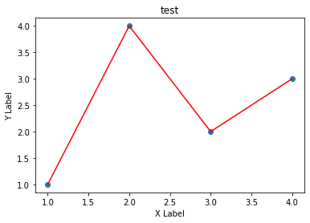

---  
layout: post  
title: "Python Matploblib 기본"
subtitle: "자꾸 까먹는 Matplotlib"  
categories: DATA
tags: DATA python Python_Data matplotlib basic matplotlib 기본
comments: true  
---  

Matplotlib를 항상 까먹어서 다시 정리한다.

# Matplotlib

```python
# 패키지
import matplotlib as mpl
import matplotlib.pyplot as plt
import numpy as np
```

## 가장 간단한 예제
- plt.show()의 역할은 `print`의 역할과 동일하다고 보면 된다.
- 즉 결과를 Out으로 내는 게 아니라 Print한다는 의미이나, 실질적으로 큰 차이는 없다고 본다.
- `r-`을 통해 빨간색 라인 타입을 보일 수 있음


```python
fig, ax = plt.subplots()  # Create a figure containing a single axes.
ax.plot([1,2,3,4], [1,4,2,3] ,'r-') # 꺾은선
ax.scatter([1,2,3,4], [1,4,2,3]) # 산점도
plt.xlabel("X Label") # X 축
plt.ylabel("Y Label") # Y 축
ax.set_title("test") # 제목
plt.show()
```


    
<!--  -->
    


## Figure의 구성


- figure는 ax를 담는 그릇이다. 각 ax는 하나의 차트, 또는 좌표평면이라고 보면 될 것 같다.


```python
fig = plt.figure()  # 빈 Figure
fig, ax = plt.subplots()  # 하나의 ax를 가진 Figure
fig, axs = plt.subplots(2, 2)  # 2X2 Grid의 Figure
```


    <Figure size 432x288 with 0 Axes>


    

    


    
![png]https://sangminje.github.io/assets/img/mat_plotlib_basic/(output_7_2.png)
    


## Axes
- Ax는 Figure안에 담기는 차트 객체를 의미한다.
- 각 Ax는 `set_title()`함수를 통해 이름을 정할 수도 있고, `set_xlabel()`, `set_ylabel()`을 통해 축 이름을 정할 수 있다.

##  Subplots 연습
- Subplot은 현실 시각화 분석에서 가장 많이 쓰이는 함수이다.
- `plt.tight_layout()`은 subplot끼리 겹치는 경우 이를 해결해 줄 수 있다.


```python
x = np.linspace(0, 10, 6)
y = x ** 2

plt.subplot(1,2,1)
plt.plot(x,y,'r')

plt.subplot(1,2,2)
plt.plot(y,x,'b')
```


    [<matplotlib.lines.Line2D at 0x129ae2c3940>]


    

    


```python
fig, axes = plt.subplots(nrows=1, ncols=2)
plt.tight_layout() # Layout을 화면에 맞춰주는 함수

for ax in axes:
    ax.plot(x,y)
```


    

    


- `axes`를 쳐보면 array 객체임을 알 수 있음, 따라서 위 명령어 처럼 ax를 반복문으로 루프를 돌릴 수 있음


```python
axes
```


    array([<AxesSubplot:>, <AxesSubplot:>], dtype=object)


## Plot function이 받는 데이터 형태
- nmupy.array 형태를 기본적으로 받음
- `ax.scatter`에서 `c`인자는 **color**를 의미하고 `s`인자는 **size**를 의미한다.
- 그래서 c인자에넌 0~49까지의 사이의 값이 들어가고, size는 d도 마찬가지이다. 


```python
b = np.matrix([[1,2],[3,4]])
b_asarray = np.asarray(b)
```


```python
np.random.seed(19680801)  # seed
data = {'a': np.arange(50),
        'c': np.random.randint(0, 50, 50),
        'd': np.random.randn(50)}
data['b'] = data['a'] + 10 * np.random.randn(50)
data['d'] = np.abs(data['d']) * 100

fig, ax = plt.subplots(figsize=(5, 2.7))
ax.scatter('a', 'b', c='c', s='d', data=data)
ax.set_xlabel('entry a')
ax.set_ylabel('entry b');
```


    

    


## 코딩 스타일
코딩 스타일은 크게 아래와 같이 두 가지로 나눈다.

**1. OO 스타일 : fig와 ax를 정확히 정의하고 들어감**

**2. pyplot자동화 : pyplot이 알아서 figure와 ax를 컨트롤하도록 함**


```python
# OO 스타일
x = np.linspace(0, 2, 100)  # Sample data.

# Note that even in the OO-style, we use `.pyplot.figure` to create the Figure.
fig, ax = plt.subplots(figsize=(5, 2.7))
ax.plot(x, x, label='linear')  # Plot some data on the axes.
ax.plot(x, x**2, label='quadratic')  # Plot more data on the axes...
ax.plot(x, x**3, label='cubic')  # ... and some more.
ax.set_xlabel('x label')  # Add an x-label to the axes.
ax.set_ylabel('y label')  # Add a y-label to the axes.
ax.set_title("Simple Plot")  # Add a title to the axes.
ax.legend();  # Add a legend.
```


    

    


```python
# pyplot  스타일
x = np.linspace(0, 2, 100)  # Sample data.

plt.figure(figsize=(5, 2.7))
plt.plot(x, x, label='linear')  # Plot some data on the (implicit) axes.
plt.plot(x, x**2, label='quadratic')  # etc.
plt.plot(x, x**3, label='cubic')
plt.xlabel('x label')
plt.ylabel('y label')
plt.title("Simple Plot")
plt.legend();
```


    

    


## Plot Styling
- plot에 `color`인자와 `linewidth`, `linestyle`등을  지정해서 스타일링 가능하다.
- `alpha`를 통해 투명도도 조정 가능


```python
data1, data2, data3, data4 = np.random.randn(4, 100)  

fig, ax = plt.subplots(figsize=(5, 2.7))
x = np.arange(len(data1))
ax.plot(x, np.cumsum(data1), color='blue', linewidth=3, linestyle='--')
l, = ax.plot(x, np.cumsum(data2), color='orange', linewidth=2)
l.set_linestyle(':');
```


    

    


### colors
- `facecolor`와 `edgecolor`등을 설정 가능합


```python
fig, ax = plt.subplots(figsize=(5, 2.7))
ax.scatter(data1, data2, s=50, facecolor='C0', edgecolor='k');
```


    

    


```python
fig = plt.figure()

ax = fig.add_axes([0,0,0.5,0.5])
ax.plot(x,y, color='r', marker='o', markersize=10, markerfacecolor="yellow", markeredgecolor="green") # 색 부여, 마커 부여
plt.show()
```


    

    


### marker


```python
fig, ax = plt.subplots(figsize=(5, 2.7))
ax.plot(data1, 'o', label='data1')
ax.plot(data2, 'd', label='data2')
ax.plot(data3, 'v', label='data3')
ax.plot(data4, 's', label='data4')
ax.legend();
```


    

    


## Labeling Plots
- `fontsize`나 `color`이용 가능하다.


```python
mu, sigma = 115, 15
x = mu + sigma * np.random.randn(10000)
fig, ax = plt.subplots(figsize=(5, 2.7))
# the histogram of the data
n, bins, patches = ax.hist(x, 50, density=1, facecolor='C0', alpha=0.75)

# ax.set_xlabel('Length [cm]')
ax.set_xlabel('my data', fontsize=14, color='red')
ax.set_ylabel('Probability')
ax.set_title('Aardvark lengths\n (not really)')
ax.text(75, .025, r'$\mu=115,\ \sigma=15$')
ax.axis([55, 175, 0, 0.03])
ax.grid(True);
```


    

    


## Limit
- `set_xlim`, `set_ylim`을 통해 X축과 y축의 범위를 정의할 수 있다.
- 작게 설정 시, Zoom-In 효과가 있다


```python
fig = plt.figure()

ax = fig.add_axes([0,0,0.5,0.5])
ax.plot(x,y, color='r', marker='o', markersize=10, markerfacecolor="yellow", markeredgecolor="green") # 색 부여, 마커 부여
ax.set_xlim([0,10]) # x limit
ax.set_ylim([0,25]) # y limit
plt.show()
```


    

    


##  Legend(범례)
 - `loc`인자를 통해 위치를 정할 수 있으며 0일 때 자동 조정이며 0~10까지 숫자에 따라 위치를 조정 가능하다.


```python
fig, ax = plt.subplots(figsize=(5, 2.7))
ax.plot(np.arange(len(data1)), data1, label='data1')
ax.plot(np.arange(len(data2)), data2, label='data2')
ax.plot(np.arange(len(data3)), data3, 'd', label='data3')
# ax.legend(loc=10); #10이면 한 가운데로 옴
ax.legend(loc=(0.76,0.63)) # 숫자로 부여 가능
```


    <matplotlib.legend.Legend at 0x129b0480eb0>


    


 참고사이트 : https://matplotlib.org/stable/tutorials/introductory/usage.html#types-of-inputs-to-plotting-functions

