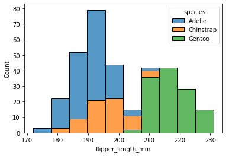

---  
layout: post  
title: "Python seaborn 기본"
subtitle: "자꾸 까먹는 seaborn"  
categories: DATA
tags: DATA python Python_Data matplotlib basic seaborn 기본
comments: true
toc: true
---  

Seaborn의 기본 내용 정리한 내용임


```python
import seaborn as sns
import matplotlib.pyplot as plt
import warnings
warnings.filterwarnings("ignore") # 경고메세지 무시
```


```python
# 펭귄데이터
penguins = sns.load_dataset("penguins")
penguins.info()
penguins.head()
```

    <class 'pandas.core.frame.DataFrame'>
    RangeIndex: 344 entries, 0 to 343
    Data columns (total 7 columns):
     #   Column             Non-Null Count  Dtype  
    ---  ------             --------------  -----  
     0   species            344 non-null    object 
     1   island             344 non-null    object 
     2   bill_length_mm     342 non-null    float64
     3   bill_depth_mm      342 non-null    float64
     4   flipper_length_mm  342 non-null    float64
     5   body_mass_g        342 non-null    float64
     6   sex                333 non-null    object 
    dtypes: float64(4), object(3)
    memory usage: 18.9+ KB
    


<div>
<style scoped>
    .dataframe tbody tr th:only-of-type {
        vertical-align: middle;
    }

    .dataframe tbody tr th {
        vertical-align: top;
    }

    .dataframe thead th {
        text-align: right;
    }
</style>
<table border="1" class="dataframe">
  <thead>
    <tr style="text-align: right;">
      <th></th>
      <th>species</th>
      <th>island</th>
      <th>bill_length_mm</th>
      <th>bill_depth_mm</th>
      <th>flipper_length_mm</th>
      <th>body_mass_g</th>
      <th>sex</th>
    </tr>
  </thead>
  <tbody>
    <tr>
      <th>0</th>
      <td>Adelie</td>
      <td>Torgersen</td>
      <td>39.1</td>
      <td>18.7</td>
      <td>181.0</td>
      <td>3750.0</td>
      <td>Male</td>
    </tr>
    <tr>
      <th>1</th>
      <td>Adelie</td>
      <td>Torgersen</td>
      <td>39.5</td>
      <td>17.4</td>
      <td>186.0</td>
      <td>3800.0</td>
      <td>Female</td>
    </tr>
    <tr>
      <th>2</th>
      <td>Adelie</td>
      <td>Torgersen</td>
      <td>40.3</td>
      <td>18.0</td>
      <td>195.0</td>
      <td>3250.0</td>
      <td>Female</td>
    </tr>
    <tr>
      <th>3</th>
      <td>Adelie</td>
      <td>Torgersen</td>
      <td>NaN</td>
      <td>NaN</td>
      <td>NaN</td>
      <td>NaN</td>
      <td>NaN</td>
    </tr>
    <tr>
      <th>4</th>
      <td>Adelie</td>
      <td>Torgersen</td>
      <td>36.7</td>
      <td>19.3</td>
      <td>193.0</td>
      <td>3450.0</td>
      <td>Female</td>
    </tr>
  </tbody>
</table>
</div>


```python
#히스토그램
sns.histplot(data=penguins, x="flipper_length_mm", hue="species", multiple="stack")
```


    <AxesSubplot:xlabel='flipper_length_mm', ylabel='Count'>


    

<!--  -->
    


```python
# kernel density estimation
sns.kdeplot(data=penguins, x="flipper_length_mm", hue="species", multiple="stack")
```


    <AxesSubplot:xlabel='flipper_length_mm', ylabel='Density'>


    

    


## Figure Level vs Axes Level Functions
1. axes-level는 `matplotlib.pyplot.axes`를 기준으로 만들어지고
2. Figure-level은 `FacetGrid`를 기준으로 만들어진다.


## Distribution Plots

### distplot
- 분포 확인
- kde차트와 히스토그램 확인가능


```python
sns.distplot(penguins["flipper_length_mm"], bins=40)
# kde=False를 하면 kde차트는 사라짐
```

    C:\Users\Jessie\anaconda3\lib\site-packages\seaborn\distributions.py:2619: FutureWarning: `distplot` is a deprecated function and will be removed in a future version. Please adapt your code to use either `displot` (a figure-level function with similar flexibility) or `histplot` (an axes-level function for histograms).
      warnings.warn(msg, FutureWarning)
    


    <AxesSubplot:xlabel='flipper_length_mm', ylabel='Density'>


    

    


### jointplot
- Scatterplot을 기본으로 각 축의 분포 확인 가능


```python
sns.jointplot(x="flipper_length_mm",y="bill_length_mm",data=penguins, hue="species")
# hue="species" - 색반환
# kind="hex" - 육각형 모양으로 반환
# kind="reg" - Regression plot
# kind="kde"  - 등고선
```


    <seaborn.axisgrid.JointGrid at 0x165bc527550>


    

    


```python
sns.jointplot(x="flipper_length_mm",y="bill_length_mm",data=penguins, kind="reg" )
```


    <seaborn.axisgrid.JointGrid at 0x165bc4fe6d0>


    

    


### pairplot
- 모든 Numeric 변수에 대하여 Scatter plot과 분포도 그림


```python
sns.pairplot(data=penguins, hue="species", palette="coolwarm")
```


    <seaborn.axisgrid.PairGrid at 0x165bf0f27c0>


    

    


### rugplot


```python
sns.rugplot(penguins["flipper_length_mm"])
```


    <AxesSubplot:xlabel='flipper_length_mm'>


    

    


## Categoricla Plots

### barplot
- `estimator`인자는 Barplot의 y축을 계량하는 기준을 의미하며 default값은 **mean**이다.


```python
import numpy as np
sns.barplot(data=penguins, x="species", y="flipper_length_mm", estimator=np.std) # 표준편차
```


    <AxesSubplot:xlabel='species', ylabel='flipper_length_mm'>


    

    


### countplot


```python
sns.countplot(data=penguins, x="species")
```


    <AxesSubplot:xlabel='species', ylabel='count'>


    

    


### boxplot


```python
sns.boxplot(x="species",y="bill_length_mm",data=penguins, hue="sex")
```


    <AxesSubplot:xlabel='species', ylabel='bill_length_mm'>


    

    


### viloin plot


```python
sns.violinplot(x="species",y="bill_length_mm",data=penguins, hue="sex", split=True)
```


    <AxesSubplot:xlabel='species', ylabel='bill_length_mm'>


    

    


### stripplot


```python
sns.stripplot(x="species",y="bill_length_mm",data=penguins, jitter=True, hue="sex", split=True)
```

    C:\Users\Jessie\anaconda3\lib\site-packages\seaborn\categorical.py:2805: UserWarning: The `split` parameter has been renamed to `dodge`.
      warnings.warn(msg, UserWarning)
    


    <AxesSubplot:xlabel='species', ylabel='bill_length_mm'>


    

    


### swarmplot
 - stripplot과 violing plot의 조합으로 볼 수 있음


```python
sns.swarmplot(x="species",y="bill_length_mm",data=penguins)
```


    <AxesSubplot:xlabel='species', ylabel='bill_length_mm'>


    

    


## Matrix chart


```python
tc = penguins.corr()
```

### Heatmap
- `annot=Ture` 인자를 통해서 히트맵에 해당하는 셀의 값을 노출할 수 있다.
- `cmap`을 통해 컬러맵 부여 가능


```python
sns.heatmap(tc,annot=True, cmap="coolwarm")
```


    <AxesSubplot:>


    

    


```python
test = penguins.pivot_table(index="species", columns="island", values="bill_length_mm")
```


```python
sns.heatmap(test, cmap="magma")
```


    <AxesSubplot:xlabel='island', ylabel='species'>


    

    


### Clustermap


```python
sns.clustermap(tc, cmap="coolwarm", standard_scale=1, annot=True)
```


    <seaborn.matrix.ClusterGrid at 0x165c2a16dc0>


    

    


## Grid


```python
iris = sns.load_dataset("iris")
iris.head()
```


<div>
<style scoped>
    .dataframe tbody tr th:only-of-type {
        vertical-align: middle;
    }

    .dataframe tbody tr th {
        vertical-align: top;
    }

    .dataframe thead th {
        text-align: right;
    }
</style>
<table border="1" class="dataframe">
  <thead>
    <tr style="text-align: right;">
      <th></th>
      <th>sepal_length</th>
      <th>sepal_width</th>
      <th>petal_length</th>
      <th>petal_width</th>
      <th>species</th>
    </tr>
  </thead>
  <tbody>
    <tr>
      <th>0</th>
      <td>5.1</td>
      <td>3.5</td>
      <td>1.4</td>
      <td>0.2</td>
      <td>setosa</td>
    </tr>
    <tr>
      <th>1</th>
      <td>4.9</td>
      <td>3.0</td>
      <td>1.4</td>
      <td>0.2</td>
      <td>setosa</td>
    </tr>
    <tr>
      <th>2</th>
      <td>4.7</td>
      <td>3.2</td>
      <td>1.3</td>
      <td>0.2</td>
      <td>setosa</td>
    </tr>
    <tr>
      <th>3</th>
      <td>4.6</td>
      <td>3.1</td>
      <td>1.5</td>
      <td>0.2</td>
      <td>setosa</td>
    </tr>
    <tr>
      <th>4</th>
      <td>5.0</td>
      <td>3.6</td>
      <td>1.4</td>
      <td>0.2</td>
      <td>setosa</td>
    </tr>
  </tbody>
</table>
</div>


### PairGrid


```python
g = sns.PairGrid(iris)
# g.map(plt.scatter) # scatter
g.map_diag(sns.distplot) # 사선에는 distplot
g.map_upper(plt.scatter) # 사선 상단에는 scatterplot
g.map_lower(sns.kdeplot) # 사선 아래에는 kdeplot
```


    <seaborn.axisgrid.PairGrid at 0x165c7fc8790>


    

    


### FacetGrid
- Categorical한 변수를 기준으로 그래프를 쪼개서 볼 수 있음
- Trellis(격자구조)의 개념이라고 생각하면 좋음


```python
tips = sns.load_dataset("tips")
tips.head()
```


<div>
<style scoped>
    .dataframe tbody tr th:only-of-type {
        vertical-align: middle;
    }

    .dataframe tbody tr th {
        vertical-align: top;
    }

    .dataframe thead th {
        text-align: right;
    }
</style>
<table border="1" class="dataframe">
  <thead>
    <tr style="text-align: right;">
      <th></th>
      <th>total_bill</th>
      <th>tip</th>
      <th>sex</th>
      <th>smoker</th>
      <th>day</th>
      <th>time</th>
      <th>size</th>
    </tr>
  </thead>
  <tbody>
    <tr>
      <th>0</th>
      <td>16.99</td>
      <td>1.01</td>
      <td>Female</td>
      <td>No</td>
      <td>Sun</td>
      <td>Dinner</td>
      <td>2</td>
    </tr>
    <tr>
      <th>1</th>
      <td>10.34</td>
      <td>1.66</td>
      <td>Male</td>
      <td>No</td>
      <td>Sun</td>
      <td>Dinner</td>
      <td>3</td>
    </tr>
    <tr>
      <th>2</th>
      <td>21.01</td>
      <td>3.50</td>
      <td>Male</td>
      <td>No</td>
      <td>Sun</td>
      <td>Dinner</td>
      <td>3</td>
    </tr>
    <tr>
      <th>3</th>
      <td>23.68</td>
      <td>3.31</td>
      <td>Male</td>
      <td>No</td>
      <td>Sun</td>
      <td>Dinner</td>
      <td>2</td>
    </tr>
    <tr>
      <th>4</th>
      <td>24.59</td>
      <td>3.61</td>
      <td>Female</td>
      <td>No</td>
      <td>Sun</td>
      <td>Dinner</td>
      <td>4</td>
    </tr>
  </tbody>
</table>
</div>


```python
g = sns.FacetGrid(data=tips, col="time", row="smoker")
# g.map(sns.distplot, "total_bill")
g.map(plt.scatter, "total_bill", "tip")
```


    <seaborn.axisgrid.FacetGrid at 0x165ca168850>


    

    


## regplot

### lmplot


```python
sns.lmplot(x="total_bill", y="tip",data=tips, hue="sex", markers=['o','v'])
```


    <seaborn.axisgrid.FacetGrid at 0x165ca196df0>


    

    


```python
sns.lmplot(x="total_bill", y="tip",data=tips,col="sex",row="time") # auto FacetGrid
```


    <seaborn.axisgrid.FacetGrid at 0x165ca32e400>


    

    


```python

```
