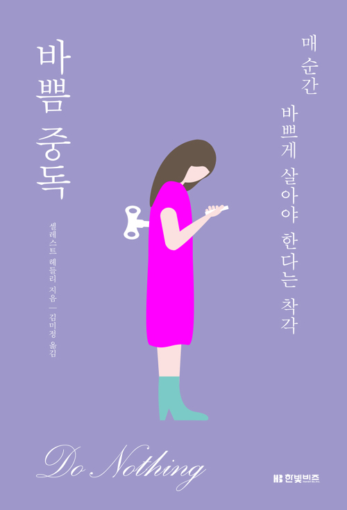

---  
layout: post  
title: "바쁨중독"
subtitle: "바쁨중독을 읽고 돌아본 나"  
categories: JESSIE
tags: think Books
comments: true 
---  

# 책 개요
---

<!--  -->
- 저자 : 셀레스트 헤들리

# 읽기 전
---
## 책을 선택한 이유

"바쁨중독"이라는 제목이 현대 사회의 특징이자 나의 상태를 잘 반영해준다고 생각했다. 그래서 이 현상을 조금 객관적으로 이해해보고, 자꾸 스스로를 다그치는 버릇이 어디서부터 비롯되었나 생각해보면서, 작가의 분석 역시도 궁금했다.

# 읽으며
---

## 목차

**1부 - 바쁨중독에 빠지다**
    1. 삶의 속도는 왜 이렇게 빨라졌을까?
    2. 증기 기관이 변화시킨 노동습관
    3. 노동은 선이고, 게으름은 악이다.
    4. 시간, 돈이 되다.
    5. 일이 집으로 들어오다.
    6. 더 많이, 더 빨리 일해야 하는 여성
    7. 일은 정말 필요한가?
    8. 우리에게 가장 필요한 기본 욕구
    9. 과학 기술이 문제일까?

**2부 여유 있는 진짜 삶을 되찾을 방안들**
    1. 자신의 업무방식을 파악하라
    2. 미디어 속 삶에 집착하지 마라
    3. 책상에서 떨어져라
    4. 여가에 투자하라
    5. 진정한 관계를 맺어라
    6. 안목을 넓혀라

# 읽은 후