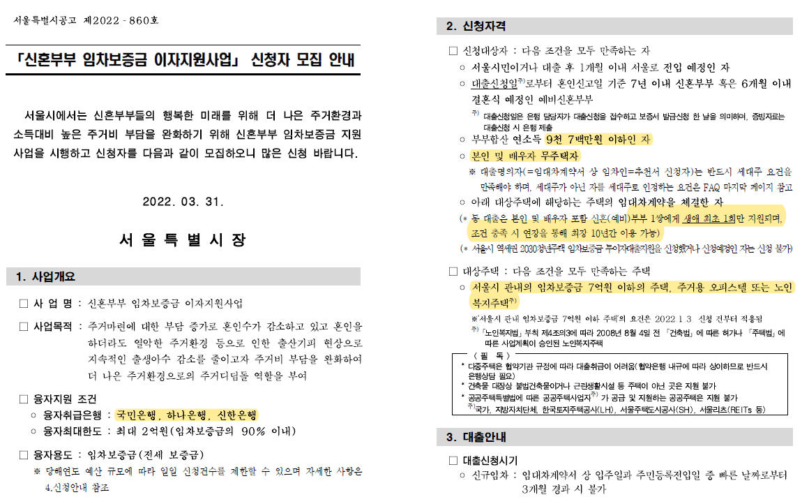

---  
layout: post  
title: "서울시 신혼부부 임차보증금 이자지원 사업 후기"
subtitle: "서울시에서 가장 싸게 전세대출 하는 방법"  
categories: JESSIE
tags: Thinks 서울시 신혼부부 전세대출 이자지원 대환
comments: true 
---  

# 개요
---
- 결혼을 준비하면서 2022년 2월 16일 전세계약을 체결했고 **"서울시 신혼부부 임차보증금 이자지원"**사업을 신청하였음
- 지금 살고 있는 집이 2억 정도이므로 약 1.8억을 대출받았으며(90%),  최종 1.5% 정도의 이자율을 책정받았고, 월 약 25만원 정도를 매달 내고 있음
- <u>신혼부부이고, 서울시에 거주 예정이고, 전세로 시작한다면 가장 좋은 조건으로 전세대출을 받을 수 있는 정책 </u>

# 사업소개
---
[서울시주거포털 - 신혼부부 임차보증금 이자지원](https://housing.seoul.go.kr/site/main/content/sh01_0400800)

<!--  -->

- 핵심 조건
    - 신혼부부 또는 예비 신혼부부
    - 부부합산 소득 9,700만원 이하
    - 서울시 관내의 임차보증금 7억원 이하의 주택, 오피스텔, 다세대 주택 등 (상세 내용은 PDF 참조)

- 취급은행
    - 국민, 신한, 하나
        - 나는 주거래은행이었던 신한은행에서 했으며, 당시 국민은행은 지원자 TO가 없다고 했음

# 진행순서
---
1. 전세매물 찾기
    - 네이버 부동산으로 열심히 전세 매물을 찾는다.
    - 마음 속의 금액을 중심으로 찾으며 목표하는 매물들의 대략적인 대출금액을 알아둔다.
2. 은행 방문
    - 은행에 방문하여 본인이 해당 사업의 대출이 가능한지 알아본다.
    - 예비 배우자의 전세 상황도 공유하여 대출이 가능한지 등등을 꼼꼼히 따지고 다음 스탭을 진행한다.
    - 개인적으로 은행을 여러 번 방문하여 등기를 보여주며 해당 매물이 가능할지 물어보았다. 처음이라 불안함이 컸다.
3. 전세매물 계약
    - 전세매물을 찾고 전세대출이 가능한 매물인지 반드시 확인. 불법건출물은 아닌지, 해당 매물에 과도한 빚은 없는지 등등
    - 매물이 확정되면 계약을 하되, 전체 계약금의 5% 이상을 지불했다는 지급 영수증을 반드시 챙긴다. (부동산 중개인이 전세대출한다고 하면 서류를 대부분 챙겨준다.)
    - <u> 계약하면 그 이후 바로 **확정일자**를 받으러 간다.</u> 등기소로 가거나 해당 주민센터로 가면 확정일자를 받아준다. 확정일자가 찍혀있어야 은행에서 대출을 실행해준다.
4. 서울주거포털 신청
    - [서울시 주거포털](https://housing.seoul.go.kr/)에 **융자신청서** 신청
    - 3일 정도 걸린다고 하나, 보통 다음날이면 담당자가 확인해줌
    - 나는 2번 정도 반려되었었는데 대부분 오타나 잘못 기입한 정보였으므로 처음부터 꼼꼼하게 작성할 것을 추천
    - 추천서가 발급되면 출력해서 나머지 서류들과 함께 챙기기
5. 은행 방문
    - 은행 방문은 배우자와 함께 가야 함
    - 같이 못가는 경우 사업소개공고문을 확인하여 적절한 서류들을 챙겨야 한다.
    - 서류는 아래와 같이 챙겨야 한다.
        - 신분증
        - 주민등록등본
        - 가족관계증명서
        - 혼인관계증명서(예비부부의 경우 혼인관계증명서를 예식장 계약서로 갈음)
        - 임대차계약서(확정일자부)
        - 지급영수증
        - 융자추천서
        - 건물등기사항전부증명서
        - 근로소득원천징수영수증(or 월급여명세서 12개월치)
        - 재직증명서(or 건강보험자격득실확인서)
6. 대출 실행 및 잔금 치르기
    - 대출이 승인되면 잔금일에 맞춰 은행에서 집주인 계좌로 송금하게 된다.
    - 잔금을 치르고 잔금일에 전입신고를 해준다.

# 주의사항
---
- 서류가 정말 많다. 일시에 따라 서류가 바뀔 수도 있으니 꼭 공고문을 다시 확인하고 서류를 챙겨가길 바람
- 임대차계약서의 **확정일자는 잔금일이 아니라 계약일에 받아야 한다.** 확정일자가 안찍혀있으면 대출을 실행할 수 없다.
- 각자 사정에 따라 궁금한 부분이 많을텐데, **QnA**문서를 꼼꼼히 읽어보면 대부분 해결할 수 있다. 나는 해당 문서를 프린트해서 형관펜으로 확인해가며 세부사항을 확인했다.
- 애매한 부분이 있다면 협약은행에 반드시 문의할 것을 당부드린다.

# 대환하는 경우
---
아내가 **중소기업청년전세대출**이 있어서 대환의 형식을 거쳤다.(당연히 중복해서 대출하는 기간이 있으면 안된다.) 우리 부부가 대환을 진행한 순서는 아래와 같다.  

1. 아내가 살던 방 내놓고 들어올 세입자와의 잔금일 확인
    - 해당 잔금일은, 우리 부부가 들어갈 잔금일보다 1주일 정도 빨라서 기간이 조금 촉박했다.
    - 은행에 방문해서 어떻게 해야 하는지 자주 물어봤다. 신한은행의 모바일톡도 애용했다.
2. 위 대출 순서 중 **5번, 은행방문** 시에 아내의 대출금이 먼저 상환될 것임을 알리고 대출을 진행한다.
    - 대출이 상환되면, 일정 영업일이 지나야 상환된 내역이 데이터로 남는다고 한다.
    - 상환이 확인되면 곧바로 다음 대출 승인이 진행된다.
    - 단점은 1주일정도 거주할 공간이 없는 일자가 생기는데, 이는 각자의 사정에 맞게 해결이 필요하다.