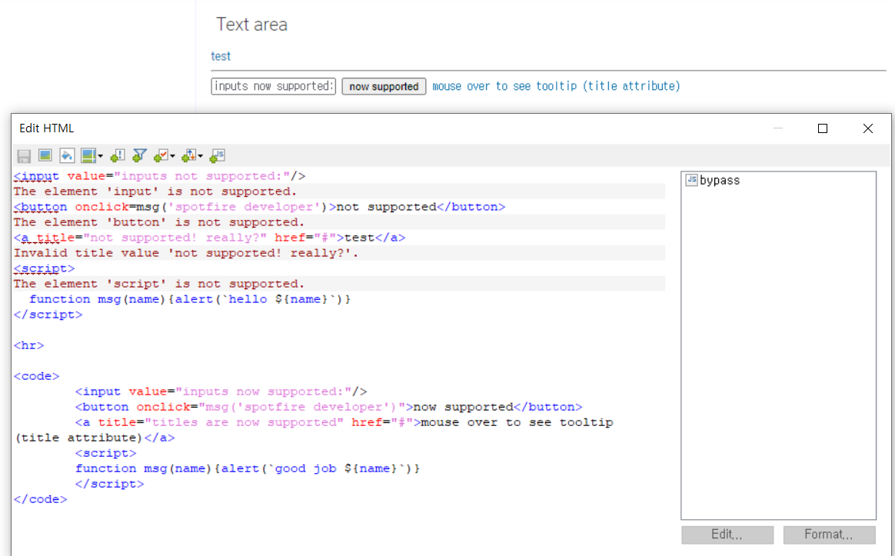

---  
layout: post  
title: "[Spotfire] Sanitaion 제거"
subtitle: "Spotfire를 Customization을 적용하기 위한 Sanitation 제거"  
categories: DATA
tags: DATA spotfire customization sanitation IronPython Javascript html css
comments: true  
---  
# Sanitation 제거
---
- 예를 들어 아래 html 코드를 Text Area 객체 - **html 편집**을 통해 Text Area에 입력한다고 가정해본다.

```html
<input value="inputs not supported:"/>
<button onclick=msg('spotfire developer')>not supported</button>
<a title="not supported! really?" href="#">test</a>
<script>
  function msg(name){alert(`hello ${name}`)}
</script>

<hr>
```
<!--  -->


- Customization을 위해서 HTML, CSS, JavaScript를 적용하면 위 그림과 같은 오류 메시지가 뜨게 된다.
	- 이런 필터링을 Spotfire에서는 Sanitation 옵션이라고 한다.
	- 프로그램 내에서 Script 사용을 통해 오작동하는 것을 방어하기 위해 Spotfire에 기본으로 설정되어져 있다.
	- 하지만 Customization을 위해서는 이 설정을 끄거나 우회해야 한다.
- 이 중 **JavaScript** 코드를 통해서 우회 가능하다.

넣는 방법은 아래와 같다.


- html을 아래와 같이 Text Area에 입력한다.
```html
<code>
	<input value="inputs now supported:"/>
	<button onclick="msg('spotfire developer')">now supported</button>
	<a title="titles are now supported" href="#">mouse over to see tooltip (title attribute)</a>
	<script>
	function msg(name){alert(`good job ${name}`)}
	</script>
</code>
```
- **JS 삽입**을 누른 후, **New**를 누르고 새로운 Script 입력창을 띄운다.


- 아래 JS 코드를 삽입한 후 이름과 설명(알기 쉽게 아무 이름과 설명 괜찮음)을 넣는다.

```javascript
//parses all code tags, but 
//does not parses properly the script tag
document.querySelectorAll("code").forEach(el=>{
	el.innerHTML = el.innerText
})

//use jQuery if you need to parse the <script> tag
//var $ = window.CustomJQuery;
//$("code").html($($("code")[0].innerText))  //parse first code tag
```

- 확인을 누른다.
- Text Area의 html이 동작되는 지 확인한다.
